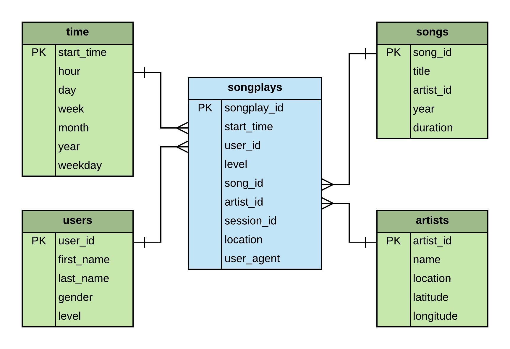

# Project-1: Data Modeling with Postgres
---
## Purpose of the project
This project deals with Data modeling with Postgres and populating the designed tables by building the ETL pipeline using python. The source data is from music streaming App called Sparkify. It is in two different parts - one is songs metadata and second is user activity logs. The complete dataset is in JSON format. The purpose of project is to design Star schema consisting fact and dimension tables which is used for songs and user activity analysis.

---

## Database schema design and ETL pipeline
The source data is modelled into star schema, consisting one fact table - songplays and four dimention tables - users, songs, artist, time. SQL commands (SELECT, CREATE, INSERT, DROP) are defined in sql_queries.py, this file is imported into etl.py file to execute the defined SQL queries. Database sparkifydb and above metioned tables are created and dropped using create_tables.py

The Diagram below specifies Database schema design with the tables and the columns

The etl.py file defines the Extract, Transform and Load process and populates the fact and dimention tables. The **songs** and **artists** tables are populated from songs metadata JSON file residing in **data/song_data** directory and the **users** and **time** tables populated from user log files, **data/log_data**.

## Repository files decription and execution procedure
The project includes six files.
1. **sql_queries.py:** contains SQL queries to Ceate, Drop specified tables and Insert statements to populate the tables.
2. **create_tables.py:** used to create and drop the tables, sql_queries.py is imported into this file to execute these actios.
3. **etl.ipynb:** reads and processes a single file from source dataset. This notebook basically used to perform ETL process for single source file and each of the tables.
4. **etl.py:** reads and process complete source dataset (song_data and log_data) and populte the defined tables.
5. **test.ipynb:** this notebook file is used to display first few rows of each table in order to ensure correctness of ETL process. Also, used to check number of records inserted into each table at the end of complete ETL process. 
6. **README.md:** provides description of the project.

Execution of python scripts
1. Open the Terminal \ CMD
2. Execute the command -**python create_tables.py** in order to create \ reset the tables.
3. Execute the command -**python etl.py** in order to process entire dataset and populate the tables.